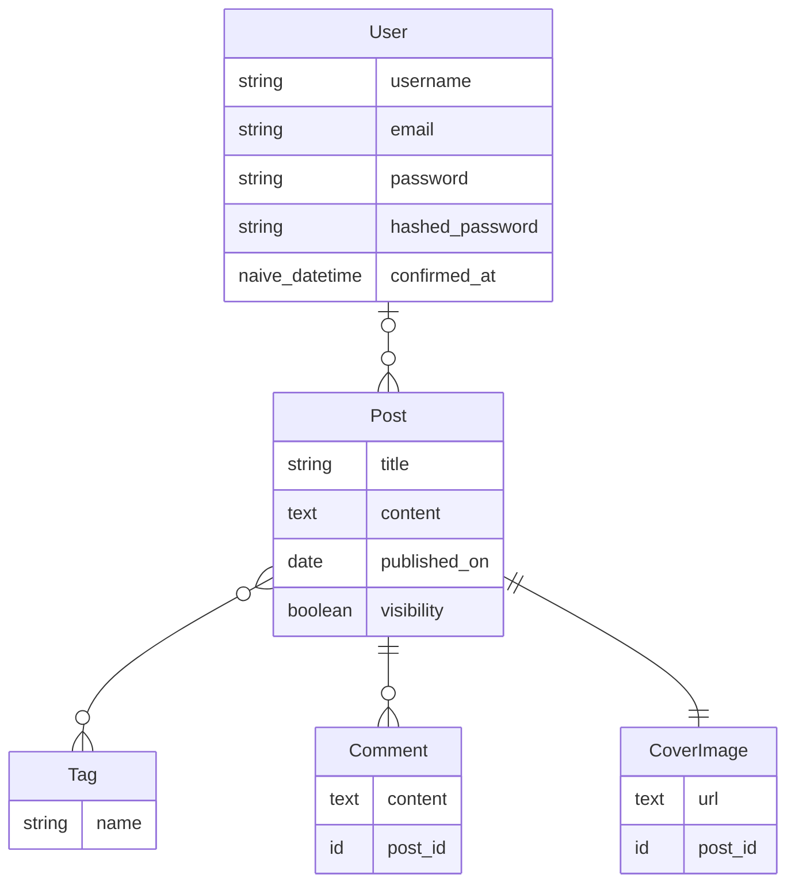

# SSP Blog

A simple blog made using Elixir, Phoenix, and Ecto.

## Contributors 
    - Shawn Haler
    - Shawn Condon
    - Patrick Struthers

## Diagram

```mermaid
erDiagram
User {
  string username
  string email
  string password
  string hashed_password
  naive_datetime confirmed_at
}

Post {
    string title
    text content
    date published_on
    boolean visibility
}

CoverImage {
    text url
    id post_id
}

Comment {
  text content
  id post_id
}

Tag {
    string name
}

User |O--O{ Post: ""
Post }O--O{ Tag: ""
Post ||--O{ Comment: ""
Post ||--|| CoverImage: ""
```